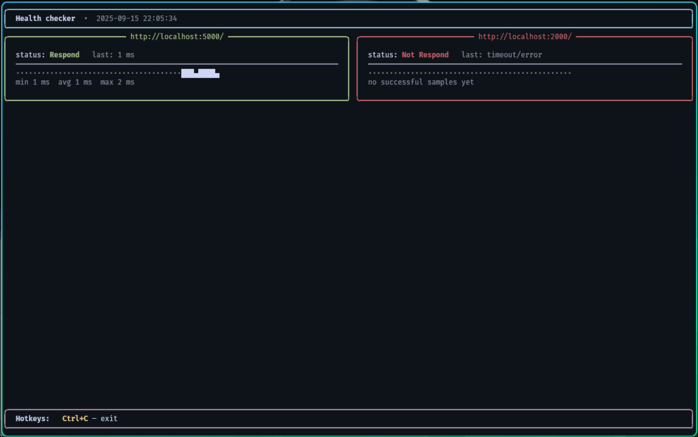
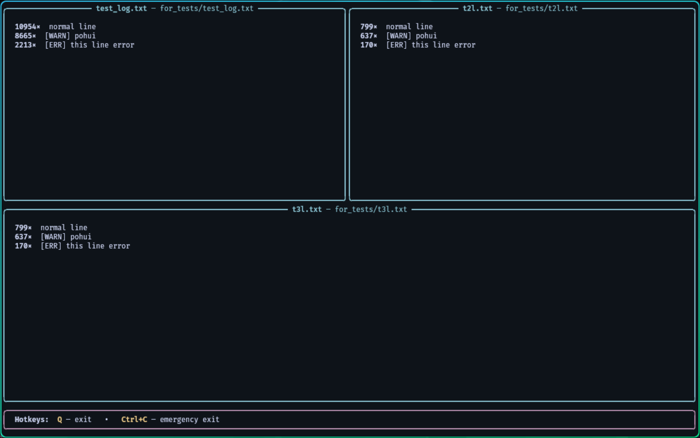

# dev-tools (RU)

Небольшой набор утилит для повседневной разработки.

Реализовано:
- **health_checker** — периодические проверки эндпоинтов (демон или TUI)
- **secret_scanner** — инструмент который мне дряется в git как хук и перед git push проверяет комит на наличие api ключей, если находит предотвращает push
- **log_analyser** — «греп» по логам, показывает только изменения
- **error_demux** — Rich TUI с топом дубликатов вывода по логам
- **tg_alarm** — минимальная отправка сообщений в Telegram
- **git_sync** — инструмент для синхронизации рабочей дириктории с удалённым репозиторием, может поднимать новую версию проекта
- **timers** — набор таймеров для отсеживания времени работы функций, как синхронных так и асинхронных
- **logger** — Rich логер с настраиваемым форматом ведения логов

Rich* - позволяет работать с цветом, помогает не запутаться в куче серого текста)

---

## Быстрый старт

```bash
pip install git+https://github.com/T1nnLD/dev-tools.git
```

---

## Инструменты

### 1) health_checker (`heath_checher.py`)

Периодически проверяет URL’ы, в случае исключения шлёт алерт в Telegram. Есть TUI с «спарклайнами» задержек.

**Конфиг (`-c`):**
```yaml
tg_id: 123456789
points:
  - url: https://api.example.com/health
    method: GET
  - url: https://api.example.com/ping
    method: POST
    data: '{"hello":"world"}'
```

**Запуск (точные флаги):**
```bash
python heath_checher.py -c hc.yaml
python heath_checher.py -c hc.yaml -i 5
python heath_checher.py -c hc.yaml -w
```
Флаги:
- `-c <PATH>` — **обязателен**, путь к YAML-конфигу
- `-i <INT>` — интервал проверок в секундах (**по умолчанию: 10**)
- `-w` — режим наблюдения (TUI)

**TODO**
- полная совместимость с запросами к базам данных
- раздельные интервалы для эндпоинтов
- сделать генератор конфига  health_checker для проектов на fastapi

**Демо в состоянии просмотра**



---
### 2) secret_scanner ()
Сканирует репозиторий или изменённые файлы на «захардкоженные» секреты. Использует набор регэкспов по провайдерам + энтропию и поддерживает baseline для подавления известных находок.

**Зачем:** поймать ключи/токены до попадания в `main` или артефакты сборки.

**Возможности:**
- Регэкспы + энтропия (AWS, GitHub, Slack, GCP, Stripe, приватные ключи, общие шаблоны).
- Работа по папкам/файлам, только по git‑tracked или только по `git diff` через `--since`.
- Точечный игнор строки: комментарий `# secret-scan: ignore`.
- Baseline‑файл для подавления «известных» находок.
- JSON для CI; завершение **кодом 1**, если есть новые находки.

**Запуск**
```bash
secret_scanner --since <branch>
```

можно настроить git хук перед push, тогда будет автоматически вызываться перед push

.git/hooks/pre-push
```bash
#!/bin/bash
current_branch=$(git rev-parse --abbrev-ref HEAD)

secret_scaner.py --since origin/$current_branch
```

если получили ложное срабатывание или нужно что-то оставить в захардкоженым то можно сгенерировать baseline
```bash
secret_scaner --update-baseline
```

есть возможность вывод в json для CI
```bash
python secret_scanner.py --since origin/main --json
```

**Опции:**
- `paths...` — файлы или директории для сканирования (по умолчанию: `.`)
- `--since <GIT_REF>` — только изменения относительно `GIT_REF..HEAD`
- `--git-tracked` — сканировать только файлы, отслеживаемые git
- `--baseline <PATH>` — путь к baseline (**по умолчанию: `.secret-scanner-baseline.json`**)
- `--update-baseline` — записать текущие находки в baseline и выйти с кодом 0
- `--json` — вывести JSON
- `--no-entropy` — отключить энтропийные эвристики
- `--ignore <GLOB>` — добавить шаблон игнора (флаг можно повторять)


**GitHub Actions (CI):**
```yaml
name: secret-scan
on: [pull_request]
jobs:
  scan:
    runs-on: ubuntu-latest
    steps:
      - uses: actions/checkout@v4
      - run: python3 secret_scanner.py --since origin/${{ github.base_ref }} --json
```

**Коды выхода:**
- `0` — нет новых находок (или был использован `--update-baseline`)
- `1` — обнаружены новые потенциальные секреты

---

### 3) log_analyser (`log_analyser.py`)

Следит за лог-файлом, выбирает строки по **регэкспу** (без учёта регистра) и отправляет найденные строки в Telegram.

**Запуск (точные аргументы):**
```bash
python log_analyser.py /var/log/app.log "ERROR|Exception|CRITICAL" 123456789
python log_analyser.py ./nginx.error.log "5[0-9]{2}" 123456789 -i 2
```
Позиционные аргументы:
- `file` — путь к логу
- `mode` — расширенный регэксп (через `|` для OR)
- `tgid` — Telegram chat ID

Необязательный флаг:
- `-i <INT>` — интервал сканирования, сек (**по умолчанию: 1**)

**Отправляется:** исходная строка с припиской `this stroke get from <path> log file`.

---

### 4) error_demux (`error_demux.py`)

Показывает топ повторяющихся строк по каждому файлу. Есть разовый отчёт и `--watch` с автообновлением. Выход — клавиша `Q`.

**Разовый отчёт:**
```bash
python error_demux.py app.log nginx.error.log -n 15
python error_demux.py app.log --ignore-case
python error_demux.py app.log --no-strip
```

**Наблюдение:**
```bash
python error_demux.py app.log other.log --watch --refresh 0.5 --fullscreen
```

Флаги и аргументы (точно):
- `files...` — один или несколько файлов (позиционные)
- `--top, -n <INT>` — топ N строк для каждого файла (**по умолчанию: 10**)
- `--ignore-case, -i` — без учёта регистра
- `--no-strip` — не обрезать пробелы по краям
- `--watch, -w` — режим наблюдения
- `--refresh <FLOAT>` — интервал обновления в секундах (**по умолчанию: 1.0**)
- `--fullscreen, -f` — полноэкранный режим

**TODO:**
- показ времени
- реализация конвеера

**Demo in watch state**


---

### 4) tg_alarm (`tg_alarm.py`)

Отправляет сообщение в указанный чат.

**Запуск (точно):**
```bash
python tg_alarm.py <chat_id> "<message>"
# пример
python tg_alarm.py 123456789 "Проблема с сервисом X: timeout"
```
---

### 5) timers (`timers.py`)

Утилита для измерения времени выполнения функций. Включает в себя:
- `InterTimer` — простой таймер с методами `start()` и `stop(name)`.
- `timer_ms` — декоратор для измерения времени выполнения синхронных и асинхронных функций.

**Пример использования:**
```python
from dev_tools import InterTimer, timer_ms

# Использование InterTimer
timer = InterTimer()
timer.start()
# ... код ...
timer.stop("initialization")

# Использование timer_ms
@timer_ms("calc")
def calc():
    # ... код ...
    pass

@timer_ms(fmt="Function {label} took {time:.2f} ms")
async def task():
    # ... код ...
    pass
```

---
### 6) logger (`logger.py`)

Rich логгер с настраиваемым форматом ведения логов. Позволяет использовать цвета и различные форматы для лучшей читаемости.

**Пример использования:**
```python
from dev_tools import log

# Логирование с цветом
log("Это сообщение будет желтым", "yellow")
log("Это сообщение будет красным", "red")

# Изменение формата логов
from dev_tools import set_log_format
set_log_format("[bold {color}]{date} - {time}[/] => {text}")
```

---

### 7) git_sync (`git_sync.py`)

Инструмент для синхронизации рабочей директории с удалённым репозиторием. Может поднимать новую версию проекта. Поддерживает игнорирование файлов и выполнение команд деплоя после синхронизации.

**Конфиг (`-c`):**
```yaml
config:
  branch: main
  interval: 1
  ignore:
    - 'git-sync.conf.yaml'
    - 'secrets/**'
  deploy:
    - 'sudo systemctl restart myapp'
    - 'echo "Deploy finished"'
```

**Запуск:**
```bash
python git_sync.py -c git-sync.conf.yaml
python git_sync.py --generate-config
```

Флаги:
- `-c <PATH>` — путь к YAML-конфигу (**по умолчанию: `./git-sync.conf.yaml`**)
- `--generate-config` — генерирует baseline конфигурационного файла

**Опции конфига:**
- `branch` — имя ветки для синхронизации (**обязательно**)
- `interval` — интервал проверки изменений в секундах (**по умолчанию: 1**)
- `ignore` — список паттернов файлов/путей для игнорирования
- `deploy` — список команд для выполнения после синхронизации

**Особенности:**
- Проверяет наличие изменений с удалённым репозиторием
- Автоматически синхронизирует локальную ветку с удалённой
- Может игнорировать определённые файлы/каталоги
- Поддерживает выполнение команд деплоя после успешной синхронизации
- Может генерировать файл sudoers для выполнения команд деплоя без пароля

---

## Как связать

- `health_checker` — шлёт оповещение при исключении запроса.
- `log_analyser` — отправляет найденные по регэкспу строки.
- `error_demux` — локальный просмотрщик/агрегатор (без Telegram).

Минимальный живой сценарий с алертами только на совпадения:
```bash
python log_analyser.py /var/log/app.log "ERROR|Exception" 123456789 -i 1
```

---

## TODO:

- создать автогенерацию конфига для health_checker
- создать надстройку для fastapi чтобы ослеживать запросы и ответы при ошибках
- создать надстройку для fastapi для блокирования вывода некоторой информации в логи, например health запросы
